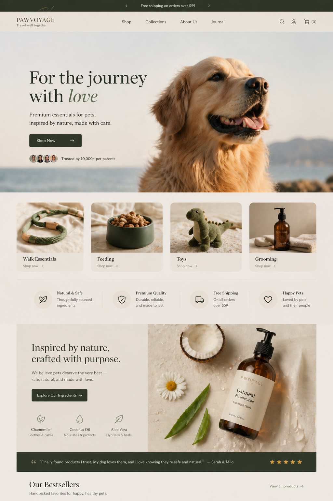
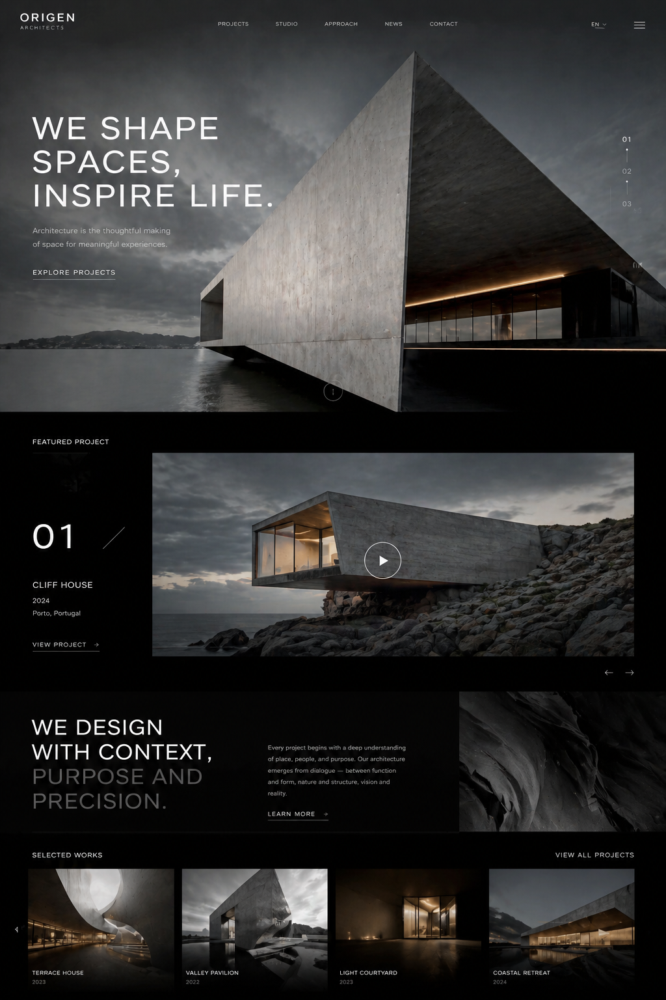
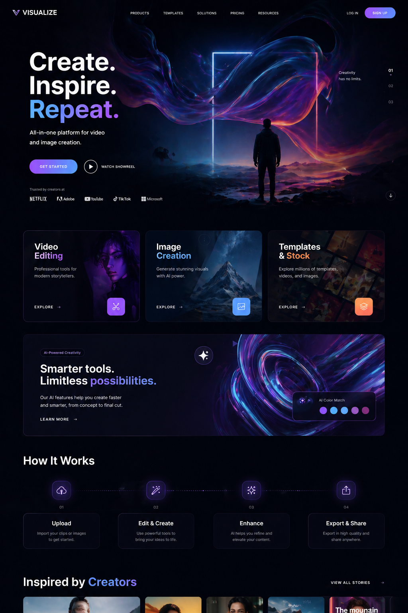
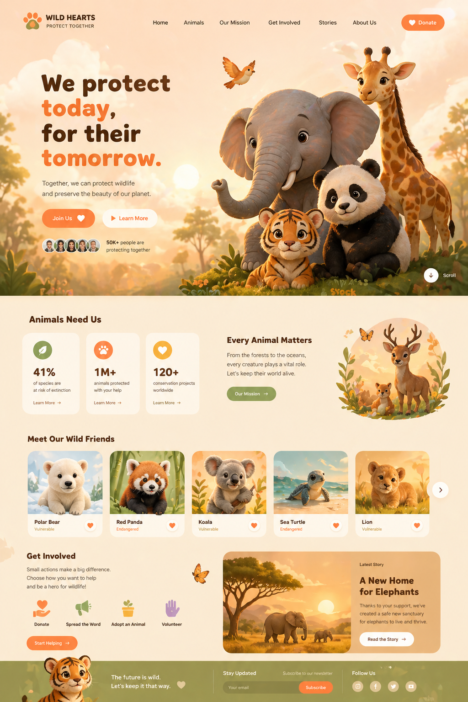

# claudesign

[English](README.md) | [简体中文](README.zh-CN.md)

`claudesign` helps you turn a vague design idea into a structured `DESIGN.md` file that AI and engineers can both use.

You can use AI to generate a first draft of `DESIGN.md`, review and refine it, validate it, compare revisions, and export design tokens for implementation.

## Two Public Capabilities

`claudesign` now exposes two user-facing capabilities:

1. `Generate DESIGN.md`
2. `Build Website from DESIGN.md`

Use this command to inspect the capability contract quickly:

```bash
npx claudesign-plugin capability list
npx claudesign-plugin capability contract
```

## Start Here

If you only want the simplest mental model:

1. Ask AI to generate a `DESIGN.md` for your product or page.
2. Edit that file until the design direction is right.
3. Run `lint` to validate it.
4. Use that `DESIGN.md` as the design brief for development.
5. Export tokens when engineering needs machine-readable output.

That is the main workflow this repo is built for.

## What This Project Is

This repo is not a drawing tool and not a Figma replacement.

It is a design workflow bundle that gives you:

- reusable design skills for AI hosts
- a structured `DESIGN.md` format for design specs
- validation with `lint`
- revision comparison with `diff`
- token export with `export`
- the same shared contract across Claude, OpenAI, Codex, and internal runtimes

## What `DESIGN.md` Is Good For

Use `DESIGN.md` when you want AI-generated design work to become more stable and easier to implement.

Typical use cases:

- generate a first-pass design system with AI
- define colors, typography, spacing, radius, and component tokens
- document visual rules and do/don't constraints
- review what changed between design revisions
- hand structured tokens to frontend engineers

It works especially well for:

- landing pages
- product UI styling
- component libraries
- brand visual baselines
- design-system handoff

## Quick Start

### 1. Install the bundle

```bash
npx claudesign-plugin install
```

This installs the default `generic` bundle to `~/.claudesign/plugins/generic`.

### 2. See what a valid `DESIGN.md` looks like

```bash
npx claudesign-plugin designmd spec --rules
sed -n '1,220p' ./skills/visual-style/DESIGN.md
```

### 3. Validate the bundled example

```bash
node ./scripts/designmd.mjs lint ./skills/visual-style/DESIGN.md
```

If this makes sense to you, replace that example path with your own `DESIGN.md`.

## Recommended User Workflow

If you are a designer, founder, or PM working with AI, this is the easiest path:

### Step 1. Generate a first draft with AI

Give AI inputs such as:

- product type
- target users
- brand keywords
- visual references
- required pages or components

Ask it to output a `DESIGN.md`.

### Step 2. Refine the file manually

Review whether the file clearly defines:

- color tokens
- typography tokens
- spacing and radius
- component rules
- layout guidance
- interaction states
- do/don't constraints

### Step 3. Validate it

```bash
node ./scripts/designmd.mjs lint ./your.DESIGN.md
```

### Step 4. Use it during development

Treat the validated `DESIGN.md` as the design source of truth for AI coding agents or frontend engineers.

### Step 5. Compare changes when the design evolves

```bash
node ./scripts/designmd.mjs diff ./old.DESIGN.md ./new.DESIGN.md
```

### Step 6. Export tokens for implementation

```bash
node ./scripts/designmd.mjs export --format tailwind ./your.DESIGN.md
node ./scripts/designmd.mjs export --format dtcg ./your.DESIGN.md
```

## Common Commands

### Install

```bash
npx claudesign-plugin install
npx claudesign-plugin install --adapter claude
  npx claudesign-plugin install --adapter openai --target ~/.claudesign/plugins/openai
```

### Capability helpers

```bash
npx claudesign-plugin capability list
npx claudesign-plugin capability spec-template
npx claudesign-plugin capability web-template
npx claudesign-plugin capability contract
```

### Inspect the format

```bash
npx claudesign-plugin designmd spec --rules
```

### Validate a spec

```bash
node ./scripts/designmd.mjs lint ./your.DESIGN.md
```

### Compare two versions

```bash
node ./scripts/designmd.mjs diff \
  ./docs/designmd-examples/taste-stitch-base.DESIGN.md \
  ./docs/designmd-examples/taste-stitch-variant.DESIGN.md
```

### Export tokens

```bash
node ./scripts/designmd.mjs export --format tailwind ./your.DESIGN.md
node ./scripts/designmd.mjs export --format dtcg ./your.DESIGN.md
```

## What Is In This Repo

- `skills/`: design capabilities and skill assets
- `agents/`: routing rules and validation cases
- `adapters/`: host-specific packaging metadata
- `scripts/`: validation and `DESIGN.md` helper commands
- `docs/`: guides, examples, and integration notes

If you are a normal user, you can ignore most of this at first and focus on `DESIGN.md` plus the commands above.

## Platform Support

- `generic`: neutral adapter for custom runtimes
- `claude`: adapter for Claude-oriented hosts
- `openai`: adapter for OpenAI-oriented hosts
- `codex`: supported through `.codex-plugin/plugin.json` and the same shared contracts

## Local Shortcuts

```bash
make validate-router
make designmd-lint
make designmd-diff-sample
make designmd-export-tailwind
make designmd-export-dtcg
make capability-list
make capability-spec-template
make capability-web-template
make capability-contract
```

## Documentation

- [Chinese README](README.zh-CN.md)
- [English Usage Guide](docs/usage.en.md)
- [中文使用说明](docs/usage.zh-CN.md)
- [Dual-Capability Workflow](docs/capabilities-workflow.md)
- [DESIGN.md Workflows](docs/designmd-workflows.md)
- [Execution Contract Notes](docs/derived-integration-note.md)

## Design Mockups

The following images are design mockups for visual preview:








## WeChat Group

Scan this QR code to join the `claudesign` WeChat group:


## Important Note

As of 2026-04-23, the upstream Google Labs `DESIGN.md` format is still marked `alpha`.

That means this workflow is already useful in practice, but the upstream format may still change over time.
